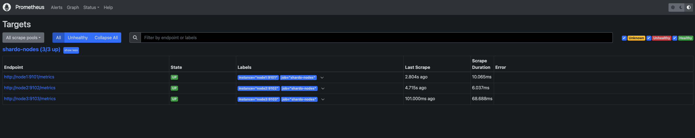
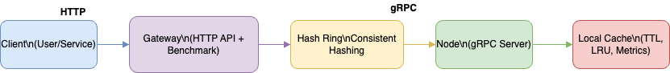
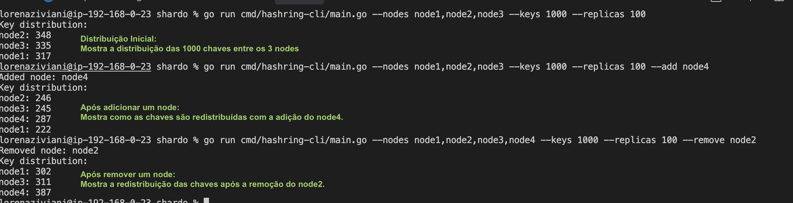
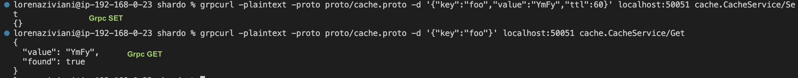
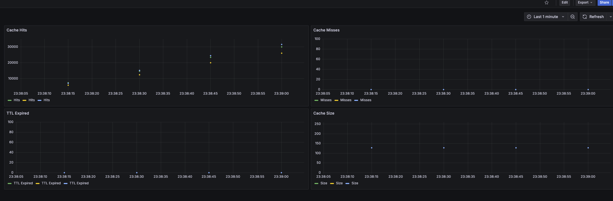

# 🚀 Shardo - Cache Distribuído Escalável com Consistent Hashing

<div align="center">


<div data-badges>
  
  
  
</div>

<div data-badges>
  
  
  
  
</div>
</div>

O **Shardo** é um sistema de cache distribuído em Go, com Consistent Hashing, APIs gRPC e HTTP, observabilidade via Prometheus/Grafana, deploy automatizado com Docker Compose e arquitetura extensível.

✔️ **Distribuição eficiente de chaves com Consistent Hashing**

✔️ **APIs gRPC e HTTP Gateway**

✔️ **Observabilidade com Prometheus e Grafana**

✔️ **Escalável, resiliente e fácil de subir (Docker Compose)**

✔️ **Testes, lint e segurança automatizados**

---

## 🖥️ Como rodar este projeto

### Requisitos:

- [Go 1.21+](https://golang.org/doc/install)
- [Docker & Docker Compose](https://docs.docker.com/get-docker/)

### Execução rápida:

1. Clone o repositório:
   ```sh
   git clone https://github.com/lorenaziviani/shardo.git
   cd shardo
   go mod tidy
   ```
2. Configure as variáveis de ambiente:
   ```sh
   cp .env.example .env
   # Edite .env conforme necessário
   ```
3. Suba o ambiente completo:
   ```sh
   docker-compose up --build
   ```
4. Acesse o gateway HTTP, Prometheus e Grafana conforme instruções do README.

---

## ✨ Exemplos de uso e prints

### 1. Distribuição de chaves (Consistent Hashing)

```sh
go run cmd/hashring-cli/main.go --nodes node1,node2,node3 --keys 1000 --replicas 100
```

---

### 2. Operação via gRPC

```sh
grpcurl -plaintext -proto proto/cache.proto -d '{"key":"foo","value":"YmFy","ttl":60}' localhost:50051 cache.CacheService/Set
grpcurl -plaintext -proto proto/cache.proto -d '{"key":"foo"}' localhost:50051 cache.CacheService/Get
```

---

### 3. Operação via Gateway HTTP

```sh
curl -X POST http://localhost:8080/set -d '{"key":"foo","value":"bar"}'
curl http://localhost:8080/get?key=foo
```

---

### 4. Observabilidade

- Endpoint Prometheus: `http://localhost:9100/metrics`
- Dashboard Grafana: `http://localhost:3000`



---

### 5. Benchmark

```sh
curl http://localhost:8080/benchmark
```

ou

```sh
make bench
```


---

### 6. Testes, Lint e Segurança

```sh
make test
make lint
make security
```

---

## 📝 Features do projeto

- 🔄 **Consistent Hashing com réplicas virtuais**
- ⚡ **Cache local com TTL, LRU, métricas de hits/miss**
- 🛰️ **APIs gRPC e HTTP Gateway**
- 📈 **Métricas Prometheus e dashboard Grafana**
- 🐳 **Deploy automatizado com Docker Compose**
- 🧪 **Testes unitários e integração**
- 🧹 **Lint e análise de segurança automatizados**
- 🧩 **Arquitetura modular e extensível**

---

## ⚙️ Comandos úteis

```sh
# Testes unitários e integração
make test

# Lint
make lint

# Análise de segurança do código
make security

# Build do binário
go build -o bin/node ./cmd/node
go build -o bin/gateway ./cmd/gateway

# Build Docker
docker-compose build

docker-compose up --build
```

---

## 🌐 Variáveis de Ambiente

```env
# .env.example
NODES=node1:50051,node2:50052,node3:50053
REPLICAS=100
CACHE_SIZE=10000
CACHE_TTL=60
GATEWAY_PORT=8080
METRICS_PORT=9100
GRPC_PORT=50051
```

---

## 📁 Estrutura de Pastas

```
shardo/
  go.mod
  go.sum
  docker-compose.yml
  Makefile
  .env.example
  cmd/
    node/
    gateway/
    hashring-cli/
  pkg/
    cache/
    hashring/
  internal/
    grpc/
    gateway/
  infra/
  docs/
  .gitassets/
    cover.png
    hashring-inicial.png
    grpc-set-get.png
    http-gateway.png
    prometheus-metrics.png
    grafana-dashboard.png
    benchmark.png
    testes.png
    lint.png
    security.png
```

---

## 🏗️ Arquitetura do Sistema



**Fluxo resumido:**

1. O gateway HTTP recebe requisições e roteia para os nodes via gRPC usando o Consistent Hashing
2. Cada node mantém um cache local com TTL, LRU e métricas
3. Métricas são expostas via Prometheus e visualizadas no Grafana
4. O ambiente é facilmente escalável e observável via Docker Compose

---

## 🖼️ Exemplos Visuais dos Cenários

### 1. Distribuição de chaves



### 2. Operação gRPC



### 3. Dashboard Grafana



---

## 💎 Links úteis

- [Go Documentation](https://golang.org/doc/)
- [Prometheus](https://prometheus.io/)
- [Grafana](https://grafana.com/)
- [Docker](https://www.docker.com/)
- [Consistent Hashing](https://en.wikipedia.org/wiki/Consistent_hashing)
- [gRPC](https://grpc.io/)
